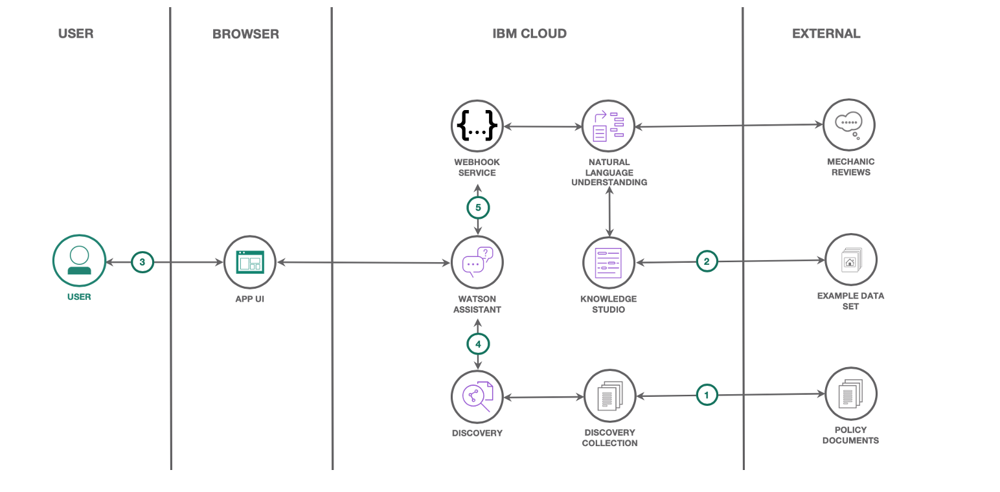
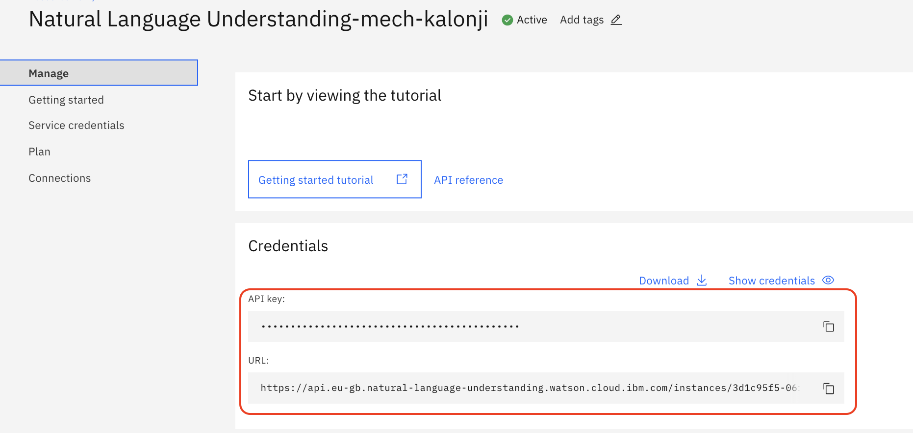
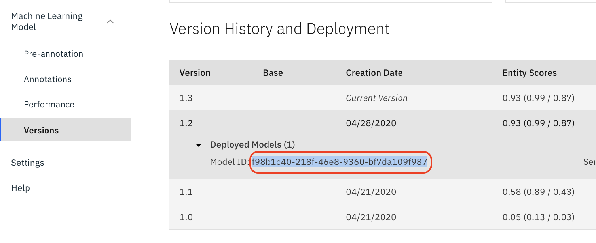
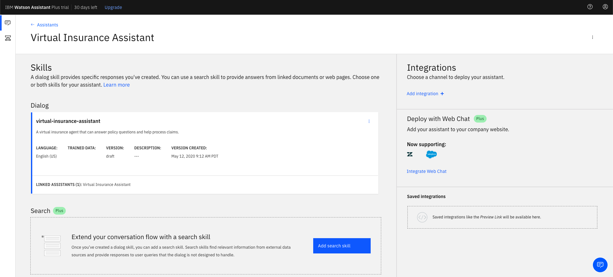
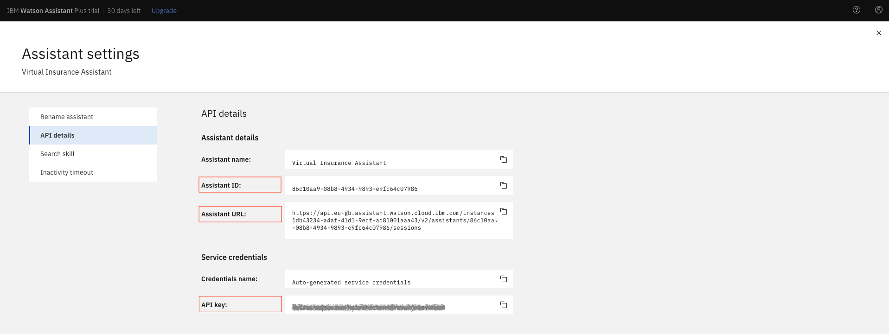
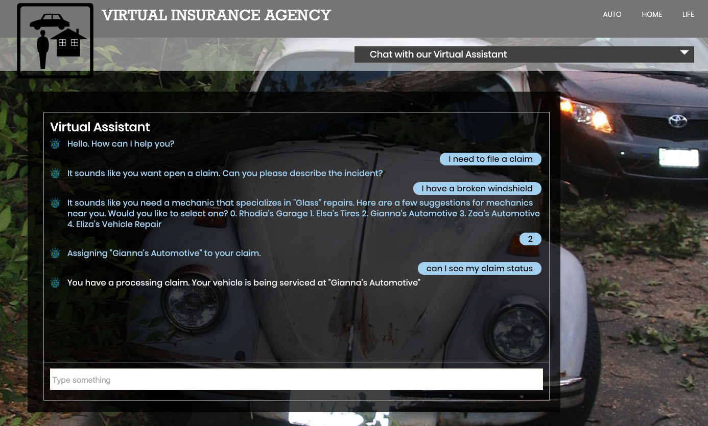

[](https://travis-ci.com/IBM/virtual-insurance-assistant)

# Build a virtual insurance assistant to help process claims

In this code pattern, we will create a chatbot to help insurance agents process claims. We will use Watson's natural
language processing capabilities, to understand, classify, and retrieve information to reduce repetitive tasks for the insurance
agent. In turn, this will free the agent to tackle more creative, and complex problems, and the majority of customers
will receive answers to their questions faster, with the help of a Watson-based virtual assistant.

When you have completed this code pattern, you will understand how to:

* Process complex insurance documents with Watson Discovery to efficiently answer customer policy questions.
* Use Watson Knowledge Studio to create custom models and entities to understand and classify mechanic reviews more accurately.
* Create a web-based application which features a virtual assistant that can answer policy questions and make recommendations based on which mechanics are highly reviewed, and covered by the policy.



## Flow

1. Insurance policy documents are uploaded to Watson Discovery, and then annotated using Watson's Smart Document Understanding tool.
2. Mechanic review documents are uploaded to Watson Knowledge Studio, and then annotated to create custom entities and relationships.
3. User chats via web-application UI to talk to Watson Assistant.
4. Watson Assistant answers policy questions using Watson Discovery's querying capabilities.
5. Watson Assistant recommends a mechanic based on the type of damage that is done to the vehicle, and on the sentiment of the customer reviews.

## Prerequisites

For a fully functional virtual insurance assistant, please complete the following tutorials first:

- [ ] [Tutorial: Process, understand, and answer policy questions with smart document understanding](https://developer.ibm.com/tutorials/analyze-and-answer-policy-questions-with-smart-document-understanding/)
- [ ] [Tutorial: Build a recommendation engine with Watson Natural Language Understanding](https://developer.ibm.com/tutorials/build-a-recommendation-engine-with-watson-natural-language-understanding)

The resulting trained Discovery collection will be used for policy inquiries. The deployed model from Knowledge Studio and the Natural Language Understanding service will be used to understand claim descriptions.

## Steps

1. [Clone the repo](#1-clone-the-repo)
1. [Gather credentials for the mechanic recommender](#2-Gather-credentials-for-the-mechanic-recommender)
1. [Gather credentials for policy inquiries](#3-Gather-credentials-for-policy-inquiries)
1. [Create the Watson Assistant skill](#4-Create-the-Watson-Assistant-skill)
1. [Deploy the application](#5-deploy-the-application)
1. [Use the app](#6-use-the-app)

## 1. Clone the repo

```bash
git clone https://github.com/IBM/virtual-insurance-assistant
```

## 2. Gather credentials for the mechanic recommender

When you completed the [Tutorial: Build a recommendation engine with Watson Natural Language Understanding](https://developer.ibm.com/tutorials/build-a-recommendation-engine-with-watson-natural-language-understanding), you deployed a machine learning model to a Watson Natural Language Understanding service to allow it to analyze mechanic reviews. We've used the same process to create a mechanic ranking by repair type (based on sentiment analysis).

Now, we'll configure the virtual insurance assistant to use the same model and service. This will allow it to understand an insurance claim and recommend the best mechanics for the type of repair needed.

Collect the `API key` and `URL` by navigating to your Natural Language Understanding instance in the IBM Cloud console.



Then, navigate to your Watson Knowledge Studio instance, select your workspace, click "Machine Learning Model", and then select "Versions"
Copy the Model ID of your latest deployed version.



These will be used later in [Deploy the application](#5-deploy-the-application). For example, in a local `.env` file:

```bash
# NLU for mechanic recommender
NATURAL_LANGUAGE_UNDERSTANDING_APIKEY=<add_nlu_apikey>
NATURAL_LANGUAGE_UNDERSTANDING_URL=<add_nlu_url>
NATURAL_LANGUAGE_UNDERSTANDING_MODEL_ID=<add_nlu_wks_model>
```

## 3. Gather credentials for policy inquiries

When you completed the [Tutorial: Process, understand, and answer policy questions with smart document understanding](https://developer.ibm.com/tutorials/analyze-and-answer-policy-questions-with-smart-document-understanding/), you trained Watson Discovery to understand a collection of insurance policy documents. We will use this Discovery service to allow the virtual insurance assistant to answer policy questions.

> Note: If you have an `Advanced Plan` instance of Discovery and need a quicker way to reproduce the results of the tutorial [read this](./data/discovery/README.md).

There are two ways to integrate Discovery with the virtual insurance assistant. The preferred way is to use a "search skill". If you will **use a search skill** you can **SKIP AHEAD** to the next section [Create the Watson Assistant skill](#2-Create-the-Watson-Assistant-skill).

If you are **NOT using the search skill**, our Node.js server will take the context returned from Watson Assistant and use the SDK to query Watson Discovery directly. This is handy if you are using a Discovery Lite plan, or if you have other reasons to manipulate the results in code. This method, however, will not work in the Watson Assistant preview or WebChat UI.

To enable policy inquires without the search skill, use the following instructions to gather credentials and configuration for the server's runtime environment.

* Take the API key and URL from your `cloud.ibm.com` Discovery service, as shown below:


* Next, click `Launch Watson Discovery` and then click on the `api` tab in the
top-right corner of the screen within Watson Discovery as shown below:


* Go ahead and grab the `collection ID` and `environment ID` from that tab.

These will be used later in [Deploy the application](#5-deploy-the-application). For example, in a local `.env` file:

```bash
# Watson Discovery (if not using the search skill)
DISCOVERY_APIKEY=<add_discovery_apikey>
DISCOVERY_URL=<add_discovery_url>
DISCOVERY_ENVIRONMENT_ID=<add_discovery_environment_id>
DISCOVERY_COLLECTION_ID=<add_discovery_collection_id>
```

## 4. Create the Watson Assistant skill

### Provision a Watson Assistant instance

* Click [here](https://cloud.ibm.com/catalog/services/watson-assistant) to find **Watson Assistant** in the IBM Cloud catalog.
* `Select a region`.
* `Select a pricing plan`. Use the `Plus Trial` plan.
* Set your `Service name` or use the generated one.
* Click `Create`.

### Create an assistant

* Click on `Launch Watson Assistant`.
* Go to the `Assistants` tab and click `Create assistant`.
* Give your assistant a unique name then click `Create assistant`.

### Add a dialog skill

Import the virtual insurance assistant skill from a JSON file in your cloned repo. From your Assistant panel:

* Click on `Add dialog skill`.
* Click the `Import skill` tab.
* Click `Choose JSON File`, go to your cloned repo dir, and `Open` the JSON file in `data/assistant/skill-virtual-insurance-assistant.json`.
* Click `Import`.

The newly created dialog skill should now be shown in your Assistant panel:



### Add a search skill

> #### What is an Assistant Search Skill?
>
> An Assistant search skill is a mechanism that allows you to directly query a Watson Discovery collection from your Assistant dialog. A search skill is triggered when the dialog reaches a node that has a search skill enabled. The user query is then passed to the Watson Discovery collection via the search skill, and the results are returned to the dialog for display to the user.
>
> Click [here](https://cloud.ibm.com/docs/services/assistant?topic=assistant-skill-search-add) for more information about the Watson Assistant search skill.

Adding a search skill is optional. Our Node.js server can instead take the context returned from Watson Assistant and use the SDK to query Watson Discovery directly, but using a search skill is preferred because it allows full use of the Assistant preview and WebChat UI.

From your Assistant panel:

* Click on `Add search skill`.
* Give your search skill a unique name, then click `Continue`.
* From the search skill panel, select the Discovery service instance and collection you created previously.
* Click `Configure` to continue.
* From the `Configure Search Response` panel, select `text` as the field to use for the `Body` of the response. Click `Create` to complete the configuration.
* From your Assistant panel, click on the three dots in the upper right-hand corner and select `Settings`.
* Select the `Search Skill` tab and ensure that is in `Enabled`.

Now, when the dialog skill node invokes the search skill, the search skill will query the Discovery collection and display the text from the policy document to the user.

### Try it in Assistant preview

Normally, you can test the dialog skill be selecting the `Try it` button located at the top right side of the dialog skill panel, but when integrated with a search skill, a different method of testing must be used.

* From your assistant panel, select `Add Integrations`.
* From the list of available integration types, select `Preview link`.
* From the `Preview link integration` panel, name your preview link and click `Create`.

If you click on the generated URL link, you will be able to interact with your dialog skill. Note that the input "Does my insurance cover glass repairs?" will trigger our search skill.

### Gather credentials

You will need your Assistant credentials to set in the runtime environment of the application.

From your Assistant panel:

* Click on the three dots in the upper right-hand corner and select `Settings`.
* Select the `API details` tab.
* Copy the following values to use in the application deployment step:
  * Assistant ID
  * Assistant URL
  * API key



* These will be used later in [Deploy the application](#5-deploy-the-application). For example, in a local `.env` file:

```bash
# Watson Assistant
ASSISTANT_ID=<add_assistant_id>
ASSISTANT_URL=<add_assistant_url>
ASSISTANT_APIKEY=<add_assistant_apikey>
```

## 5. Deploy the application

Click on one of the options below for instructions on deploying the Node.js server.

| | | |
| :-: | :-: | :-: |
| [](doc/source/local.md) | [](doc/source/openshift.md) | [](doc/source/cf.md) |

## 6. Use the app

### Use a browser to access the UI and chatbot

Browse to the app URL (for local deployment use http://localhost:8080).

Below, you can see the web-application in action, querying Watson in natural language:


### Ask the following questions to try the Discovery integration using smart document understanding:

1. Does my insurance cover glass repairs?
2. Does my coverage include medical expenses?
3. Does my insurance cover damage to my vehicle
4. Does my insurance coverage apply for injury to me?
5. Does my insurance cover the cost of my personal belongings damaged in an accident?
6. Does my coverage apply to legal costs?
7. What happens if I get in an accident with an uninsured motorist?

### Follow this example to invoke the mechanic recommender with NLU and your WKS model:



## Troubleshooting

* No Watson Assistant. Please configure the runtime environment and restart the server.

  > The chatbot will say this if you run it without configuring an Assistant APIKEY, URL and ID. Follow the deployment instructions to provide the .env settings or runtime environment.

* Sorry, currently I do not have a response. Discovery is not configured.

  > The chatbot will say this if you try a policy inquiry, but the search skill was not created. It is trying to call the Discovery service via the SDK, but finds the DISCOVERY_ environment variables were not set. Follow the deployment instructions to provide the .env settings or runtime environment (or add a search skill).

* BadRequest - "dialog skill" is trying to invoke missing "search skill" for the given agent

  > This error indicates that your assistant does not have search skill.

* NLU service not configured. Unable to determine repair type. Is NLU configured?

  > This error indicates that your assistant is trying to use NLU to determine the type of repair needed, but either NLU is not configured or it could not recognize a known repair type. Follow the deployment instructions to provide the .env settings or runtime environment for NLU. If you did not configure NLU the server output will say "NLU service not configured".

* Unable to determine repair type. Is NLU configured?

  > See above. This is the same error message, but NLU is configured. This happens if either the NATURAL_LANGUAGE_UNDERSTANDING_MODEL_ID is not configured or not trained properly. It can also happen if you describe an accident that does not include a repair type that it is trained to recognize.

## License

This code pattern is licensed under the Apache License, Version 2. Separate third-party code objects invoked within this code pattern are licensed by their respective providers pursuant to their own separate licenses. Contributions are subject to the [Developer Certificate of Origin, Version 1.1](https://developercertificate.org/) and the [Apache License, Version 2](https://www.apache.org/licenses/LICENSE-2.0.txt).

[Apache License FAQ](https://www.apache.org/foundation/license-faq.html#WhatDoesItMEAN)
