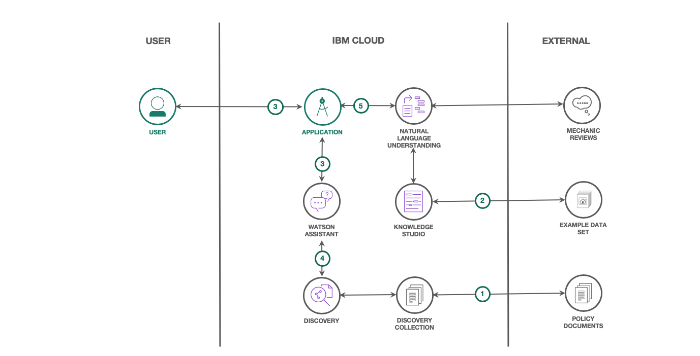
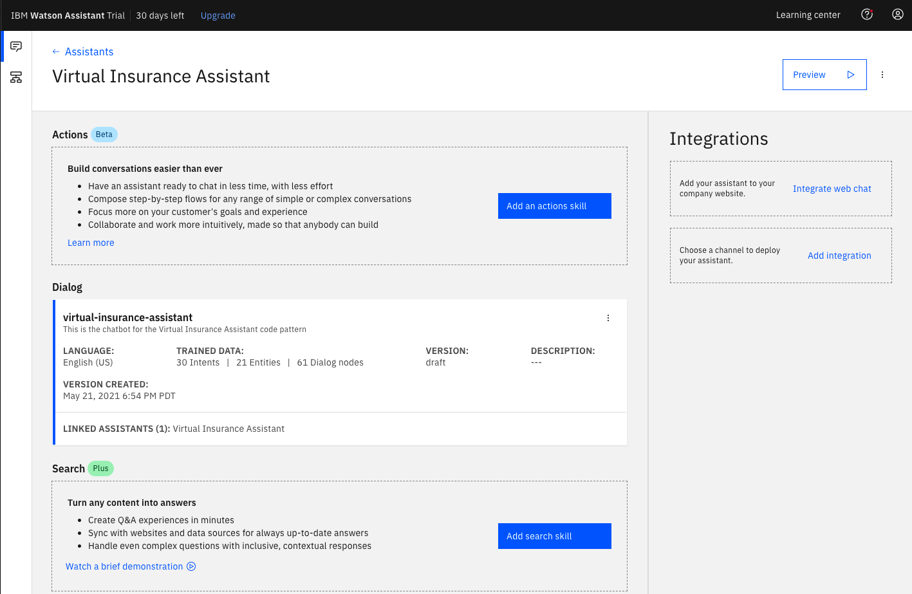
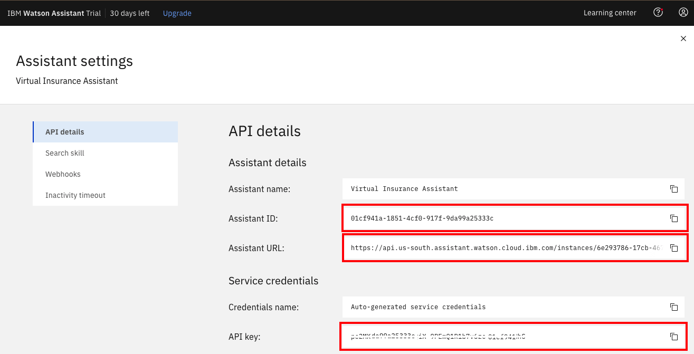

# Build a virtual insurance assistant to help process claims

In this code pattern, we will create a chatbot to help insurance agents process claims. We will use Watson's natural
language processing capabilities, to understand, classify, and retrieve information to reduce repetitive tasks for the insurance
agent. In turn, this will free the agent to tackle more creative, and complex problems, and the majority of customers
will receive answers to their questions faster, with the help of a Watson-based virtual assistant.

When you have completed this code pattern, you will understand how to:

* Process complex insurance documents with Watson Discovery to efficiently answer customer policy questions.
* Use Watson Knowledge Studio to create custom models and entities to understand and classify mechanic reviews more accurately.
* Create a web-based application which features a virtual assistant that can answer policy questions and make recommendations
based on which mechanics are highly reviewed, and covered by the policy.



## Flow

1. Insurance policy documents are uploaded to Watson Discovery, and then annotated using Watson's Smart Document Understanding tool.
2. Mechanic review documents are uploaded to Watson Knowledge Studio, and then annotated to create custom entities and relationships.
3. User chats via web-application UI to talk to Watson Assistant.
4. Watson Assistant answers policy questions using Watson Discovery's querying capabilities.
5. Watson Assistant recommends a mechanic based on the type of damage that is done to the vehicle, and on the sentiment of the customer reviews, using the Webhook feature.

## Steps

1. [Clone the repo](#1-clone-the-repo)
1. [Create the Watson Assistant skill](#2-Create-the-Watson-Assistant-skill)
1. [Deploy the application](#3-deploy-the-application)
1. [Configure Dialog Webhook](#4-Configure-Dialog-Webhook)
1. [Train Watson Discovery to answer insurance policy questions](#5-Train-Watson-Discovery-to-answer-insurance-policy-questions)
1. [Use the app](#6-use-the-app)

## 1. Clone the repo

```bash
git clone https://github.com/IBM/virtual-insurance-assistant
```

## 2. Create the Watson Assistant skill

### Provision a Watson Assistant instance

* Click [here](https://cloud.ibm.com/catalog/services/watson-assistant) to find **Watson Assistant** in the IBM Cloud catalog.
* `Select a region`.
* `Select a pricing plan`. Use the `Plus Trial` plan.
* Set your `Service name` or use the generated one.
* Click `Create`.

### Create an assistant

* Click on `Launch Watson Assistant`.
* Go to the `Assistants` tab and click `Create assistant`.
* Give your assistant a unique name then click `Create assistant`.

### Add a dialog skill

Import the virtual insurance assistant skill from a JSON file in your cloned repo. From your Assistant panel:

* Click on `Add dialog skill`.
* Click the `Import skill` tab.
* Click `Choose JSON File`, go to your cloned repo dir, and `Open` the JSON file in `data/assistant/skill-virtual-insurance-assistant.json`.
* Click `Import`.

The newly created dialog skill should now be shown in your Assistant panel:



### Gather credentials

You will need your Assistant credentials to set in the runtime environment of the application.

From your Assistant panel:

* Click on the three dots in the upper right-hand corner and select `Settings`.
* Select the `API details` tab.
* Copy the following values to use in the application deployment step:
  * Assistant ID
  * Assistant URL
  * API key



## 3. Deploy the application

Click on one of the options below for instructions on deploying the Node.js server.

| | | |
| :-: | :-: | :-: |
| [](doc/source/local.md) | [](doc/source/openshift.md) | [](doc/source/cf.md) |

## 4. Configure Dialog Webhook

Click on your dialog skill to edit it.

In the left menu, click "Options" then "Webhooks".

In the URL field, enter your server's public endpoint in the format `http://<IP_ADDR>:<PORT>/recommender/assistant`


### Test in Assistant Tooling


Normally, you can test the dialog skill be selecting the `Try it` button located at the top right side of the dialog skill panel, but when integrated with a search skill, a different method of testing must be used.

From your assistant panel, select `Add Integrations`.


From the list of available integration types, select `Preview link`.

From the `Preview link integration` panel, name your preview link and click `Create`.

If you click on the generated URL link, you will be able to interact with your dialog skill. Note that the input "how do I turn on the heater?" has triggered our `Ask about product` dialog node and invoked our search skill.


### Use a browser to access the UI and chatbot

Browse to localhost:8080 (depending on deployment options).

The user interacts with the backend server via the app UI. The frontend app UI is a chatbot that engages the user in a conversation.

### The chatbot helps process incomplete claims

* Ask "what is my claim status"

### The chatbot can recommend mechanics based on review analysis

Shows how to use NLU to process reviews and recommend the best mechanics based on the client zipcode.

> Tutorial: [Building a recommendation  engine for an Insurance  platform using AI Services]()

The chatbot uses the results to...

Demonstrate how to leverage recommender from VIA

* Triggered by a specific question
  * Ask "what is my claim status"
* Triggered by customer’s open claims and status
  * “You have an incomplete claim, would you like help looking for a mechanic in your area ?”
  * Glass repair

* Respond "yes" when asked for mechanic recommendations

> Note:  The details of understanding...

Next, we will add more features to our virtual assistant by using Watson Discovery to process complex insurance policy documents.

## 5. Train Watson Discovery to answer insurance policy questions

### If you want to use the free version of Discovery, skip to [this section](https://github.com/IBM/virtual-insurance-assistant#the-chatbot-answers-policy-questions-by-querying-discovery-free-instance-option)

### The chatbot answers policy questions by querying Discovery (Paid instance required)

1. You create a paid version of Watson Discovery which will enable you to import the model from the
tutorial. This approach is faster, and you will not have to annotate the insurance document yourself. To do this approach,
first ensure you have a Watson Discovery Advanced plan. This one requires a credit card. Once you create it (the process
is the same as shown in [here](https://github.ibm.com/ibm-developer-eti-ai-analytics/virtual-insurance-agent/tree/master/sdu_demo#create-your-watson-discovery-service) - except you select Advanced instead of Lite).

* Once you create the service, and then click on the service from the cloud.ibm.com homepage, it should show
`plan Advanced` in the right hand side of the page, as shown below:


* Next, click on `Launch Watson Discovery` and then create a collection and add in the `sample-insurance.docx` file from the
`sdu_demo` directory as shown below:


* Once Watson is done processing the document, click on `Configure data` in the top-right corner of the screen,
as shown below:


* Next, click on `Import model` and select the `insurance-policy.sdumodel` file from the `sdu_demo` directory as shown below.


* Once the
model is applied, you should see a green notification in the top-right corner of the screen.

### Manage the fields in your document

* After you have annotated pages 6-11, click on the `Manage fields` tab in the upper-left corner of your screen.

* On the left-hand side of the page, under `Identify fields to index`, turn off the `footer` field.

* Next, click on `split document on each occurrence of`, and select `subtitle` so that we split the document by subtitle.

* Lastly, click on `Apply changes to collection` and add in the same `sample-insurance.docx` file you uploaded at first.

* Once your upload is done, you will be taken to the overview page. Refresh your browser to see that Watson is working to split the
documents. After Watson is done, we should have over 10
documents. This is because we have split the original document into multiple, smaller documents based
on the subtitle. This makes retrieving the answer to a particular question a lot easier for Watson,
and enables us to get more accurate enrichments as well, such as sentiment analysis.


### Query Watson in natural language

* One of the main benefits of Watson is its ability to answer questions from your document in natural language. Before we do this, let's configure Watson to answer us directly with the text it has analyzed from our insurance document.

* Click on the magnifying glass icon in the sidebar on the left-hand side of the screen. Next click on `more-options` at the bottom of the screen.

* Next, under `Passages` select `No` for `Include relevant passages`.

* Next, under `Documents` for `fields to return` select `text`.

* Lastly, for `Number of documents to return` select `3`.

* Scroll back up to the top of hte page, and under `Search for documents` make sure `Use natural language` is selected. Then ask Watson the following question: `Does my insurance cover glass repairs?`. Once the answer comes back in the top-right corner, `Summary` will be selected. Go ahead and click on `JSON`.

* You should see that Watson will pull out the relevant text from the document that says the insurance company will pay for replacement or repair of the glass in your vehicle's windscreen, sunroof, or windows if the vehicle is lost or damaged.

* Repeat the process for `Does my coverage include medical expenses?` and `Does my insurance cover damage to my vehicle`.


## The chatbot answers policy questions by querying Discovery (Free Instance option)

If you choose the free approach, follow the [tutorial here](https://github.ibm.com/ibm-developer-eti-ai-analytics/virtual-insurance-agent/blob/master/sdu_demo/README.md). Once you are finished with the tutorial, click on the `api` tab in the
top-right corner of the screen within Watson Discovery as shown below:


<!-- TODO: how to we approach Disco SDK vs Search Skill so that this makes sense? -->

* Go ahead and grab the `collection ID` and `environment ID` from that tab.

* Next, let's take the API key and URL from our `cloud.ibm.com` Discovery service, as shown below:


<!-- TODO: this could/should be other runtime environment settings. Not just .env -->
* Change the following lines in the `.env` file from the keys that you saved above.

```bash
DISCOVERY_APIKEY=<add_discovery_apikey>
DISCOVERY_URL=<add_discovery_url>
DISCOVERY_ENVIRONMENT_ID=<add_discovery_environment_id>
DISCOVERY_COLLECTION_ID=<add_discovery_collection_id>
```

This will allow the UI application to ask Discovery for answers to certain questions. Try and test Discovery with the following questions that we have trained Watson on.

### Add a search skill

> #### What is an Assistant Search Skill?
>
> An Assistant search skill is a mechanism that allows you to directly query a Watson Discovery collection from your Assistant dialog. A search skill is triggered when the dialog reaches a node that has a search skill enabled. The user query is then passed to the Watson Discovery collection via the search skill, and the results are returned to the dialog for display to the user.
>
> Click [here](https://cloud.ibm.com/docs/services/assistant?topic=assistant-skill-search-add) for more information about the Watson Assistant search skill.

Before creating the search skill you should complete the prerequisite tutorial. The Watson Discovery service populated and trained with insurance policy documents will be used here.

From your Assistant panel:

* Click on `Add search skill`.
* Give your search skill a unique name, then click `Continue`.
* From the search skill panel, select the Discovery service instance and collection you created previously.
* Click `Configure` to continue.
* From the `Configure Search Response` panel, select `text` as the field to use for the `Body` of the response. Click `Create` to complete the configuration.
* From your Assistant panel, click on the three dots in the upper right-hand corner and select `Settings`.
* Select the `Search Skill` tab and ensure that is in `Enabled`.

Now when the dialog skill node invokes the search skill, the search skill will query the Discovery collection and display the text from the policy document to the user.

## 6. Use the app

### Use a browser to access the UI and chatbot

Browse to localhost:8080 (depending on deployment options).

Below, you can see the web-application in action, querying Watson in natural language:


Ask the following questions:

1. Does my insurance cover glass repairs?
2. Does my coverage include medical expenses?
3. Does my insurance cover damage to my vehicle
4. Does my insurance coverage apply for injury to me?
5. Does my insurance cover the cost of my personal belongings damaged in an accident?
6. Does my coverage apply to legal costs?
7. What happens if I get in an accident with an uninsured motorist?

## Troubleshooting

* BadRequest - "dialog skill" is trying to invoke missing "search skill" for the given agent

  > This error indicates that your assistant does not have search skill.

* Sorry, currently I do not have a response. Discovery is not configured.

  > This indicates that the server is trying to call Discovery directly instead of using a search skill, but the runtime environment is not configured to use discovery.

* Connection to Webhook failed.

  > This shows up in the logs when your webhook is not properly configured (the IP_ADDR:HOST needs to be configured) or you configured an IP_ADDR:HOST that is not reachable.

## License

This code pattern is licensed under the Apache License, Version 2. Separate third-party code objects invoked within this code pattern are licensed by their respective providers pursuant to their own separate licenses. Contributions are subject to the [Developer Certificate of Origin, Version 1.1](https://developercertificate.org/) and the [Apache License, Version 2](https://www.apache.org/licenses/LICENSE-2.0.txt).

[Apache License FAQ](https://www.apache.org/foundation/license-faq.html#WhatDoesItMEAN)
