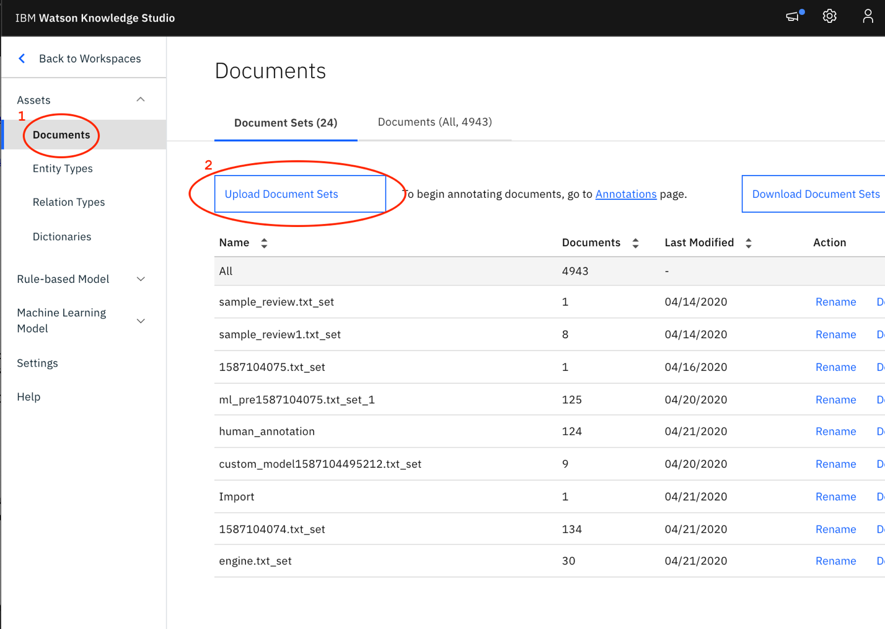
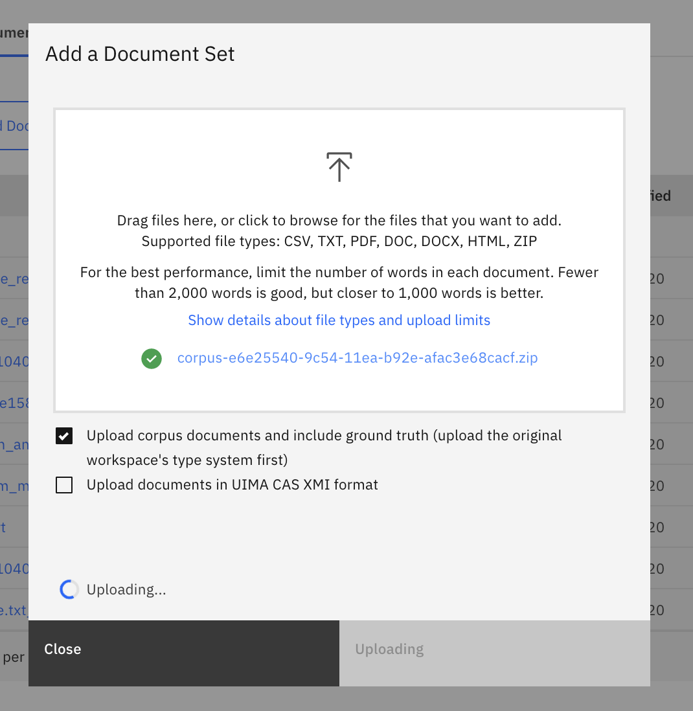
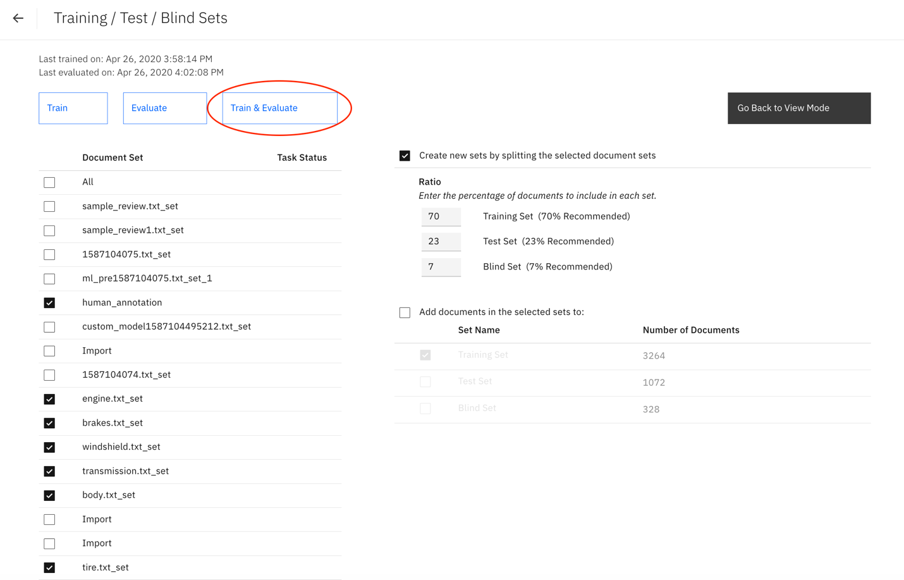
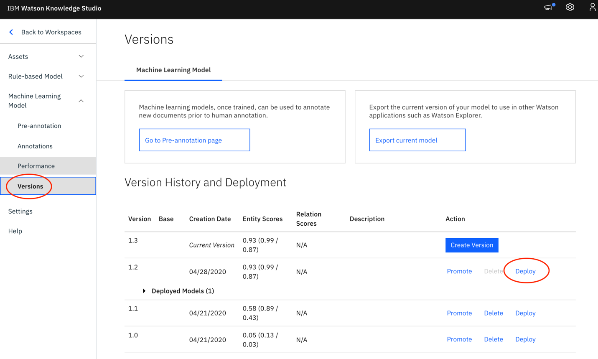
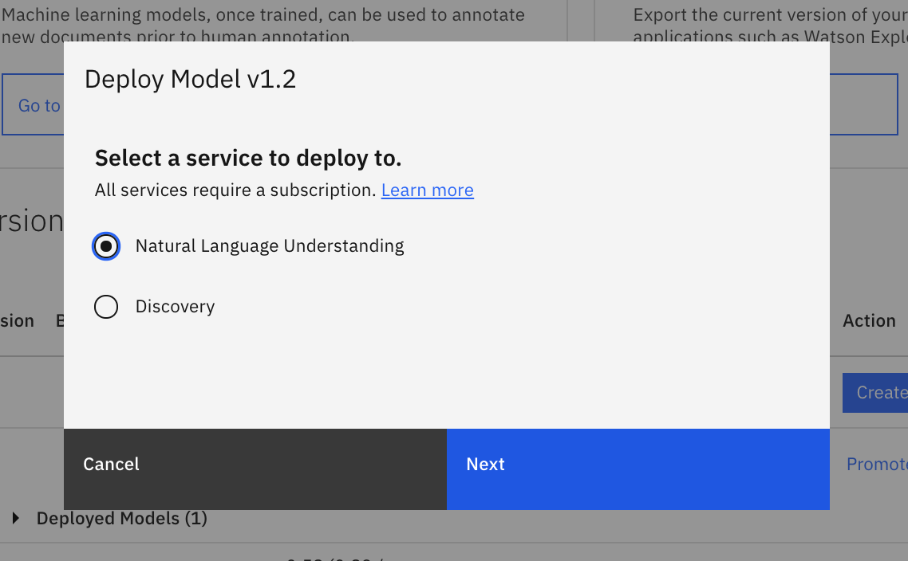
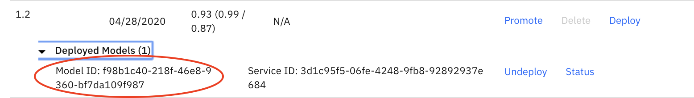

### Steps

**Import entity types.**

Download the json types file [here](https://github.com/IBM/virtual-insurance-assistant/tree/master/data/wks/types-8c501370-8411-11ea-9a22-cf86d29dec48.json). Then click "Upload".

**Import pre-annotated synthetic reviews**

Download zip file [here](https://github.com/IBM/virtual-insurance-assistant/tree/master/data/wks/corpus-e6e25540-9c54-11ea-b92e-afac3e68cacf.zip).

Click the "Upload Document Sets" button.

Upload the corpus zip file by dragging and dropping it to the "Add a Document Set" section.

**Train Model**

Select the "Performance" option in the left menu.

Click "Train and Evaluate".

**Deploy Model**

Click "Versions" to view your trained models. Then click "Deploy"

Select "Natural Language Understanding" and click "Next".

Then, select your Region, Resource Group, and Service Name, and click "Deploy".

Once the deployment is finished, you should see a new entry in the "Deployed Models" list. Expand it to get your "Model ID".

