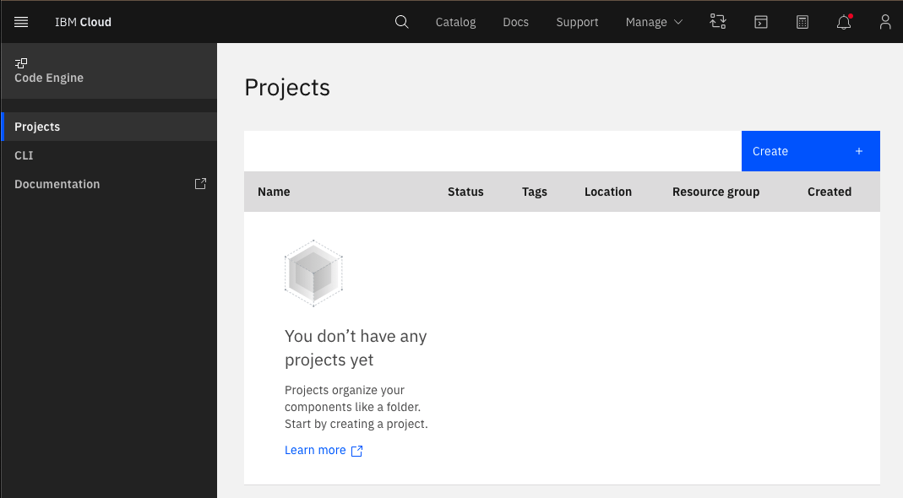
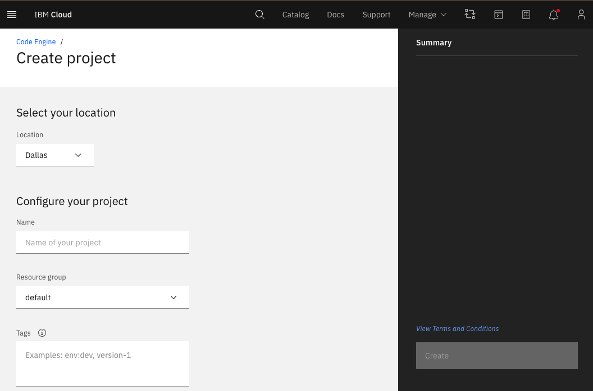
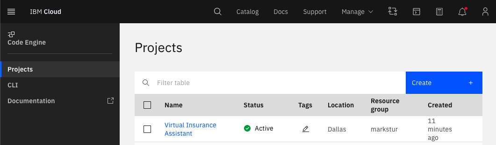
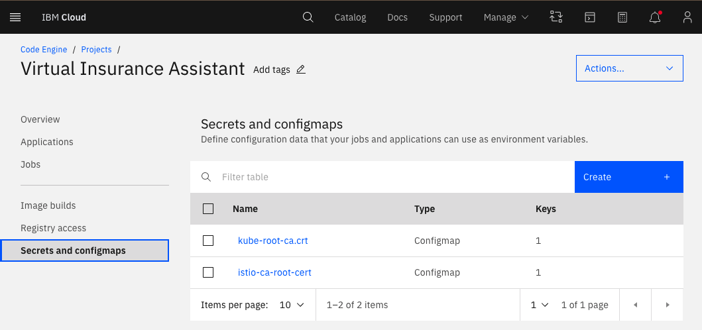
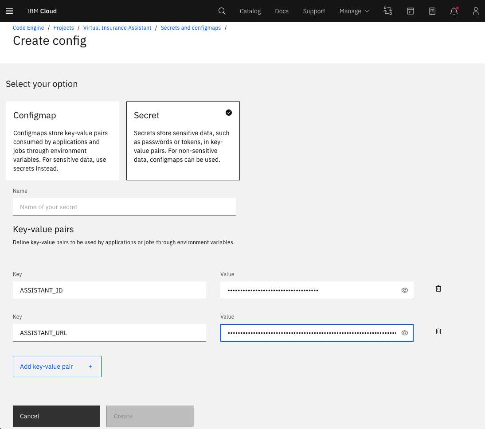
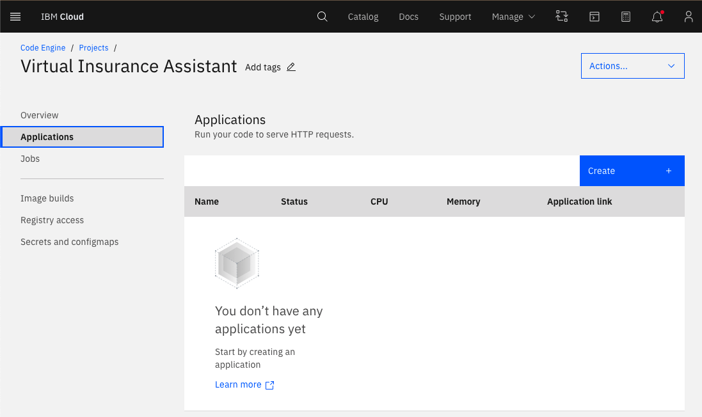
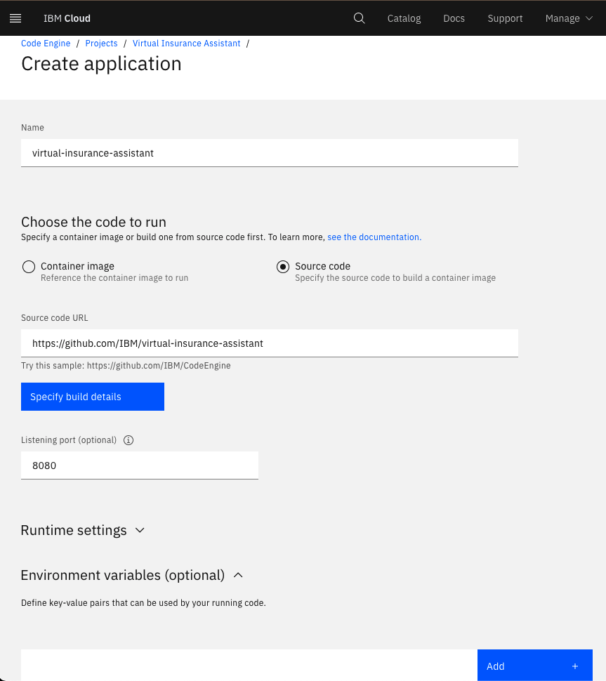
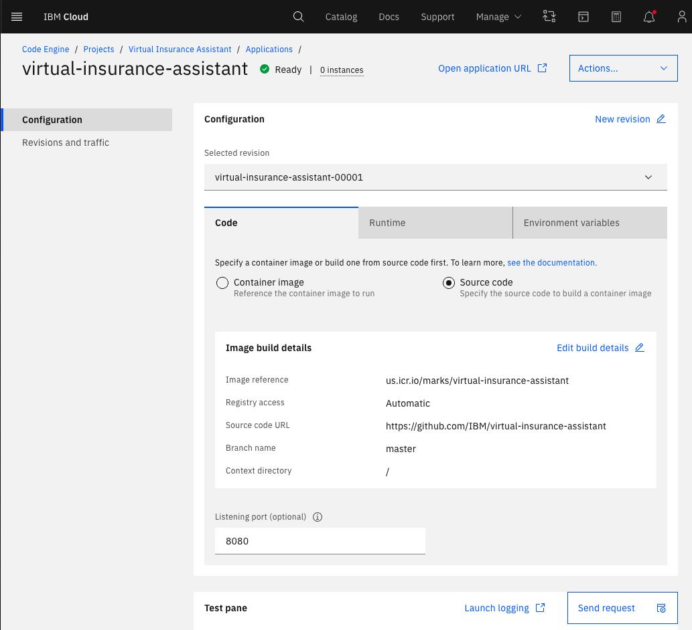
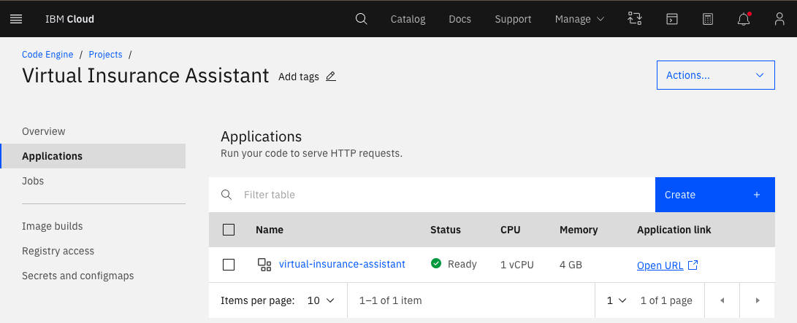

# Deploy in IBM Cloud Code Engine

This document shows how to deploy the application in a container running on IBM Cloud Code Engine.

## Steps

1. [Create a Code Engine project](#1-create-a-code-engine-project)
1. [Create the secrets](#2-create-the-secrets)
1. [Create an application](#3-Create-an-application)
1. [Run the web app](#4-run-the-web-app)

## 1. Create a Code Engine project

* Go to the [Code Engine > **Projects**](https://cloud.ibm.com/codeengine/projects) in the [Code Engine console](https://cloud.ibm.com/codeengine/projects)

  

* Click the `Create +` button
  * Select a `Location` and `Resource group`.
  * Give your project a `Name`
  * Click the `Create` button

  

* When the project `Status` becomes `Active`, click on the project name.

  

## 2. Create the secrets

* Inside your project, select `Secrets and configmaps` in the sidebar, and click the `Create +` button

  

* Under `Select your option` select `Secret` (to better protect your APIKEY)
* Name your secret
* Use the `Add key-value pair +` button and define key-value pairs for all the credentials and IDs that you gathered in the earlier steps (see the following tables)
* Click the `Create` button after you have added all the key-value pairs

  

  **Assistant and NLU credentials and IDs:**

  | Key | Value |
  | --- | --- |
  | ASSISTANT_ID | <add_assistant_id> |
  | ASSISTANT_URL | <add_assistant_url> |
  | ASSISTANT_APIKEY | <add_assistant_apikey> |
  | NATURAL_LANGUAGE_UNDERSTANDING_APIKEY | <add_nlu_apikey> |
  | NATURAL_LANGUAGE_UNDERSTANDING_URL | <add_nlu_url> |
  | NATURAL_LANGUAGE_UNDERSTANDING_MODEL_ID | <add_nlu_wks_model> |

  **Discovery credentials and IDs (optional):**

  If you are **NOT** using the search skill, configure Discovery with the following information.

  | Key | Value |
  | --- | --- |
  | DISCOVERY_APIKEY | <add_discovery_apikey> |
  | DISCOVERY_URL | <add_discovery_url> |
  | DISCOVERY_ENVIRONMENT_ID | <add_discovery_environment_id> |
  | DISCOVERY_COLLECTION_ID | <add_discovery_collection_id> |

## 3. Create an application

* Go back to you project, select `Applications` in the sidebar, and click the `Create +` button

  

* Give your application a name
* Under `Choose the code to run`, select `Source code`
* Use `https://github.com/IBM/virtual-insurance-agent` as the `Source code URL`

  

* Click the `Specify build details` button
  * Set the branch name to `master` and click `Next`
  * Select `Cloud Native Buildpack` as the strategy and click `Next`
  * Specify the output registry details and click `Done`

* The `Listening port` should be 8080

* Click the `Environment variables (optional)` dropdown and then click the `Add +` button
  * Select `Reference to full secret`
  * Use the `Secret` dropdown to select the secret you created in the previous step
  * Click `Add`

* Click the `Create` button

  

* After the application status changes to `Ready` click `Open application URL`

## 4. Run the web app

* To find your application URL later, or to manage your application

  * Use `Code Engine ▷ Projects`
  * Click your project name
  * Select `Applications`
  * Click `Open URL` to use the app or click your application name for more details

  

* Go back to the README.md for instructions on how to use the web app.

