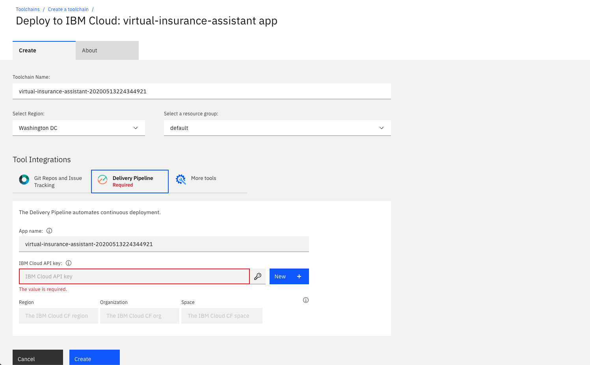

# Run on IBM Cloud with Cloud Foundry

This document shows how to run the application using Cloud Foundry on IBM Cloud.

## Steps

1. Press the above `Deploy to IBM Cloud` button and then click on the `Delivery Pipeline` tool integration.

   

   * Create an API key by pressing the `New +` button located next to the `IBM Cloud API key` field and then `OK` in the pop-up.
   * Select your region, organization, and space (or use the defaults).
   * Click `Create` to start the deployment process.

2. From the Toolchains view, click on the `Delivery Pipeline` to watch while the app is deployed. Here you'll be able to see logs about the deployment.

3. Go back to your IBM Cloud resource list and click on the Cloud Foundry application named `virtual-insurance-assistant` with a timestamp suffix. Click on `Runtime environment` and add the credentials and IDs that you gathered in the earlier steps. The app will restart with the new runtime environment.

| Key | Value |
| --- | --- |
| ASSISTANT_ID | <add_assistant_id> |
| ASSISTANT_URL | <add_assistant_url> |
| ASSISTANT_APIKEY | <add_assistant_apikey> |
| NATURAL_LANGUAGE_UNDERSTANDING_APIKEY | <add_nlu_apikey> |
| NATURAL_LANGUAGE_UNDERSTANDING_URL | <add_nlu_url> |
| NATURAL_LANGUAGE_UNDERSTANDING_MODEL_ID | <add_nlu_wks_model> |

If you are **NOT** using the search skill, configure Discovery the same way with the following information.

| Key | Value |
| --- | --- |
| DISCOVERY_APIKEY | <add_discovery_apikey> |
| DISCOVERY_URL | <add_discovery_url> |
| DISCOVERY_ENVIRONMENT_ID | <add_discovery_environment_id> |
| DISCOVERY_COLLECTION_ID | <add_discovery_collection_id> |

## Run the web app

To see the app created and configured for this code pattern, use the IBM Cloud dashboard. The Cloud Foundry app is named `virtual-insurance-assistant` with a timestamp suffix. Click on the app and then click on `Visit App URL`.

Go back to the README.md for instructions on how to use the web app.

