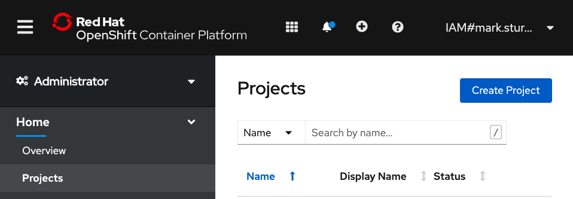
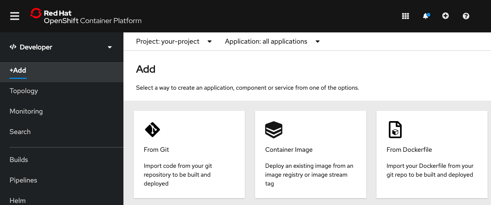
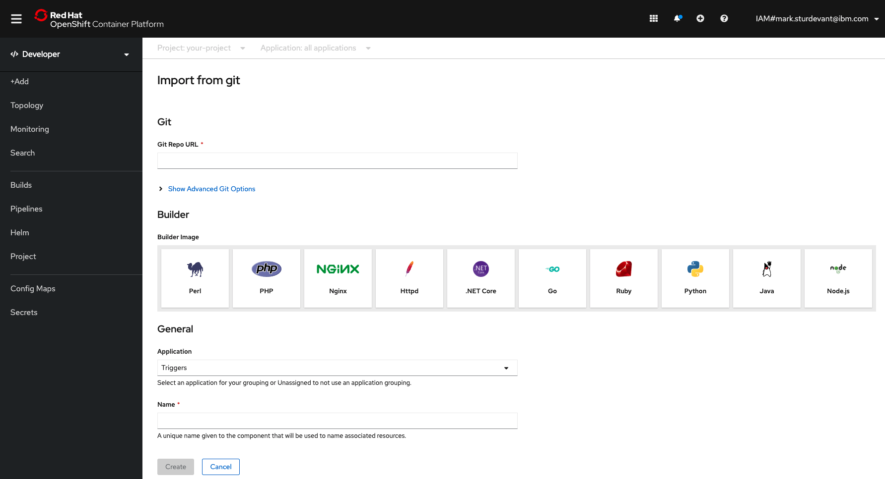
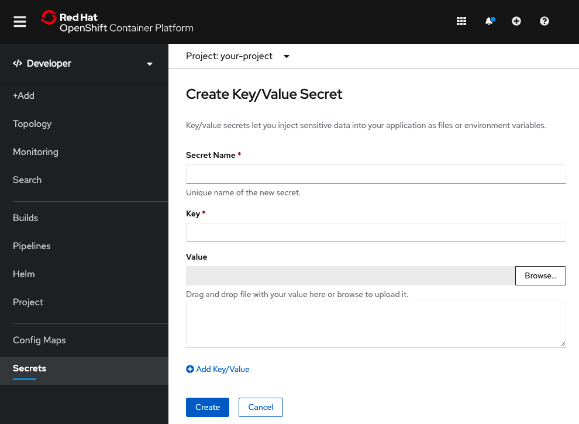
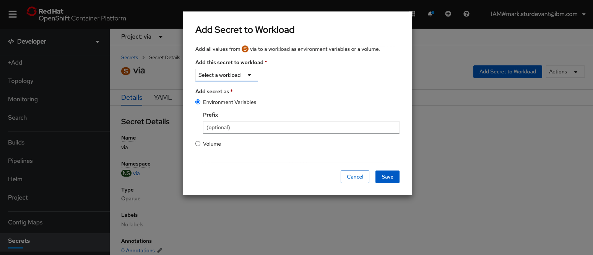
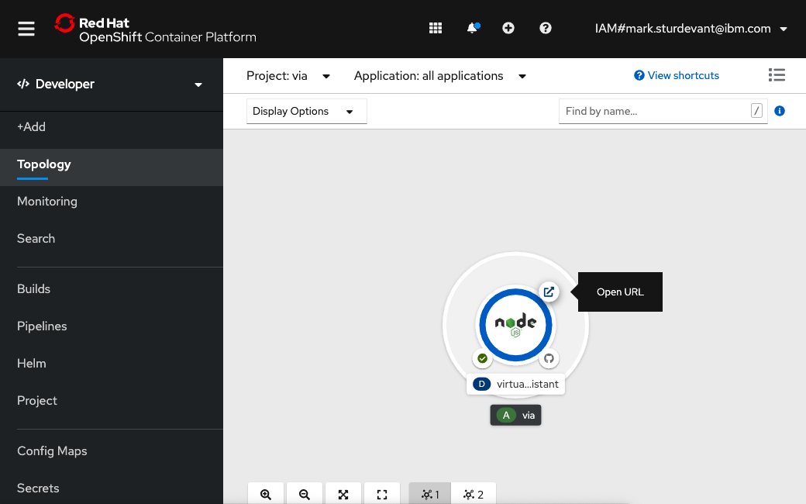

# Run on Red Hat OpenShift

This document shows how to run the application in a container running on Red Hat OpenShift.

## Prerequisites

You will need a running OpenShift cluster, or OKD cluster. You can provision [OpenShift on the IBM Cloud](https://cloud.ibm.com/kubernetes/catalog/openshiftcluster).

## Steps

1. [Create an OpenShift project](#1-create-an-openshift-project)
1. [Add the application](#2-add-the-application)
1. [Add a secret](#3-add-a-secret)
1. [Run the web app](#4-run-the-web-app)

## 1. Create an OpenShift project

* Using the OpenShift web console, select the `Administrator` perspective, expand the `Home` dropdown, and select `Projects`.

  

* Use the `Create Project` button to create a new project.

## 2. Add the application

* Select the `Developer` perspective and click on `+Add` dropdown

  

* Use the `Project` dropdown to select your project and click on `From Git`.

  

* Set the `Git Repo URL` to `https://github.com/IBM/virtual-insurance-assistant`.
* Select `Node.js` for the `Builder Image`.
* Give your app a `Name`.
* Keep the other defaults:
  * `Resource type` should be `Deployment`
  * `Create a route to the application` should be checked.

## 3. Add a secret

* Select `Secrets` in the left sidebar and then use the `Create` dropdown to select `Key/Value Secret`.

  

* Provide a `Secret Name`.

* For each of the following key/value pairs, click `Add Key/Value`, add the Key, and paste the `Value` in the input box. Use the credentials and IDs that you gathered in the earlier steps.

  | Key | Value |
  | --- | --- |
  | ASSISTANT_ID | <add_assistant_id> |
  | ASSISTANT_URL | <add_assistant_url> |
  | ASSISTANT_APIKEY | <add_assistant_apikey> |
  | NATURAL_LANGUAGE_UNDERSTANDING_APIKEY | <add_nlu_apikey> |
  | NATURAL_LANGUAGE_UNDERSTANDING_URL | <add_nlu_url> |
  | NATURAL_LANGUAGE_UNDERSTANDING_MODEL_ID | <add_nlu_wks_model> |

  If you are **NOT** using the search skill, configure Discovery the same way with the following information.

  | Key | Value |
  | --- | --- |
  | DISCOVERY_APIKEY | <add_discovery_apikey> |
  | DISCOVERY_URL | <add_discovery_url> |
  | DISCOVERY_ENVIRONMENT_ID | <add_discovery_environment_id> |
  | DISCOVERY_COLLECTION_ID | <add_discovery_collection_id> |

* Click the `Create` button.

* Click the `Add Secret to Workload` button.

  

* Use the `Select a workload` dropdown to select your deployment.

* Under `Add secret as`, select `Environment Variables`.

* Click the `Save` button.

## 4. Run the web app

* Select `Topology` in the left sidebar to see your running application.

  

* Use the `Open URL` icon to open the application web page.

* Go back to the README.md for instructions on how to use the web app.

